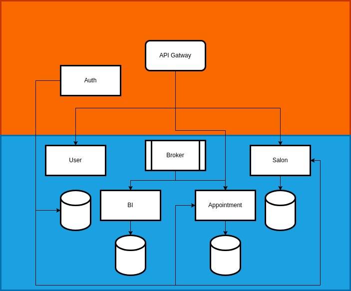

# Beauty salon microsservices

Beauty salon microsservices is a project for make user's appointmens in a beauty salon

## [Check out the documentation on the wiki](https://github.com/LeandroAlcantara-1997/beauty_salon_microsservices/wiki)

## Architecture

## How to run project? 

1. Have a Docker installed

2. Setup env variables for each service (read each service's documentation) and create an .env file in folder build with credentials of external tools.
~~~env
RABBIT_PASSWORD=
RABBIT_USER=
SPLUNK_PASSWORD=password
~~~
- [appointments](appointments/README.md)

3. Open your terminal and execute: 
~~~make
make run
~~~

## **Look at project progress on [kanban board](https://github.com/LeandroAlcantara-1997/beauty_salon_microsservices/projects?type=classic)**